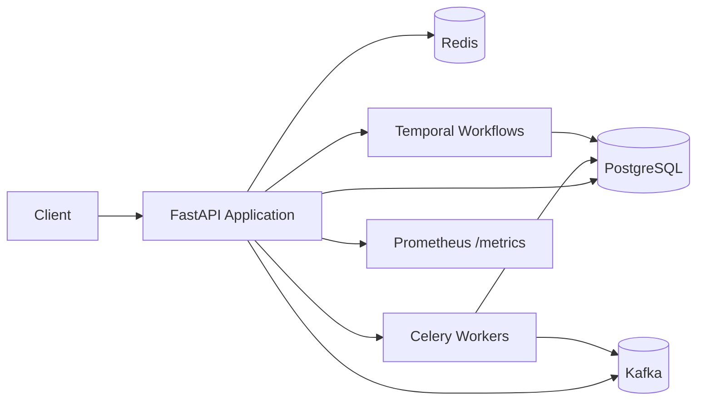

# SmartHealth

SmartHealth is a FastAPI backend for healthcare scheduling and clinic operations. It supports patient booking, provider and service management, appointment lifecycle tracking, and operational observability.

## Overview

The platform includes:

- secure authentication and role-based authorization
- patient, provider, department, and service management
- slot publishing and reservation workflows
- appointment creation, rescheduling, cancellation, and visit tracking
- billing pre-check support (mock implementation)
- asynchronous workflow processing through Temporal and Celery
- structured logging, correlation IDs, and Prometheus metrics
- appointment reminder tracking and scheduling (database-only; external delivery out of scope)
- healthcare assistant with LLM-powered responses and safety checks
- audit trail and observability across all operations

See [Scope and Limitations](#scope-and-limitations) for functionality that is intentionally outside the project scope.

## Core capabilities

- patient onboarding and authentication flows
- provider and department configuration
- service catalog publishing and status tracking
- slot-based scheduling and availability checks
- appointment booking with idempotency protection
- audit-friendly observability across HTTP, worker, and workflow boundaries

## Architecture summary

SmartHealth is organized into a modular FastAPI service with clear domain boundaries:

- API layer: request handling, routing, auth, and public endpoints
- service layer: business logic and workflow orchestration
- repository layer: persistence and data access
- schema layer: request/response validation with Pydantic
- workflow layer: Temporal-oriented orchestration for complex flows
- background workers: Celery task execution and integrations
- observability layer: structured logging, correlation IDs, and metrics



## Technology stack

- FastAPI for HTTP APIs and Swagger/OpenAPI documentation
- SQLAlchemy for ORM/data access
- PostgreSQL for persistent application data
- Redis for idempotency and shared operational state
- Celery for background workers and async execution
- Kafka for event-driven integration patterns
- Temporal for workflow orchestration and saga-style flows
- Prometheus + prometheus-client for metrics and scraping
- Alembic for database versioning and migration management

## Quick start

## Production setup

The repo keeps the original local environment file intact. For production, create a separate environment file instead of editing `.env` directly:

```bash
copy .env.production.example .env.production
```

Update the values in `.env.production` with real secrets, hostnames, and credentials. The app is configured to load `.env` and then `.env.production`, so production values can override local defaults without deleting the original environment.

Then run the stack with the production env file:

```bash
docker compose --env-file .env.production up -d --build
```

The repo also includes production-ready Make targets:

```bash
make prod-env
make prod-up
make prod-migrate
make prod-down
```

### 1. Start the local environment

```bash
docker compose up --build
```

This starts PostgreSQL, Redis, Kafka, Temporal, the API, Celery, the Temporal worker, and the analytics consumer. The API container applies migrations before serving traffic. Open `http://localhost:8000/docs` to inspect the API.

To run the application manually instead, continue with the steps below.

### 2. Configure environment

Copy the example environment file and update values as needed:

```bash
copy .env.example .env
```

### 3. Start supporting infrastructure

```bash
docker compose up -d
```

This brings up the main dependencies required by the platform:

- PostgreSQL
- Redis
- Kafka
- Temporal

### 4. Install dependencies

```bash
pip install -r requirements.txt
```

### 5. Apply database migrations

```bash
alembic upgrade head
```

### 6. Start the API service

```bash
uvicorn app.main:app --reload
```

### 7. Start background workers

```bash
celery -A app.celery_app worker --loglevel=info
```

### 8. Start Temporal workflow worker if required

```bash
python -m app.workers.service_publish_worker
```

## API overview

### Healthcare Assistant (AI)

The assistant provides intelligent, safety-checked responses to patient and staff queries. All responses undergo medical advice refusal checks and PHI (Protected Health Information) scoping.

- `POST /assistant/ask`
  - streams answers to healthcare questions
  - safety-checks prevent medical diagnosis and treatment advice
  - responses are logged with refusal status and latency metrics

- `POST /assistant/report`
  - generates operational utilisation reports
  - requires analytics read permission
  - returns structured report JSON

**Note:** The assistant requires a configured LLM provider. Set `LLM_API_KEY` and `LLM_BASE_URL` for production. Local development can run with a deterministic fake LLM (see Testing section).

### Authentication

- `POST /auth/register`
  - creates a user account
  - supported roles: `patient`, `provider`, `front_desk`, `admin`

- `POST /auth/login`
  - validates credentials
  - returns an access token

### Health and monitoring

- `GET /health`
  - liveness check for the API

- `GET /metrics`
  - Prometheus-formatted metrics endpoint

Prometheus is included in Docker Compose and scrapes the API every 15 seconds. With the local stack running, inspect the metrics at `http://localhost:8000/metrics` and confirm the API target is `up` at `http://localhost:9090/targets`. The exported domain counters include `appointments_booked_total`, `double_booking_prevented_total`, `events_consumed_total`, and `events_failed_total`.

- `GET /docs`
  - Swagger UI for API inspection

### Core domain APIs

#### Departments

- `POST /api/v1/departments`
- `GET /api/v1/departments`

#### Providers

- `POST /api/v1/providers`
- `GET /api/v1/providers`
- `GET /api/v1/providers/{provider_id}/slots`

#### Services

- `POST /api/v1/services`
- `POST /api/v1/services/{service_id}/publish`
- `POST /api/v1/services/{service_id}/unpublish`
- `GET /api/v1/services/{service_id}/publish-status`
- `GET /api/v1/services`

#### Slots

- `POST /api/v1/slots`
- `GET /api/v1/slots`

#### Appointments

- `POST /api/v1/appointments`
- `GET /api/v1/appointments/{appointment_id}/state`
- `POST /api/v1/appointments/{appointment_id}/cancel`
- `POST /api/v1/appointments/{appointment_id}/reschedule`
- `POST /api/v1/appointments/{appointment_id}/billing/pre-check`
- `POST /api/v1/appointments/{appointment_id}/visit/check-in`
- `POST /api/v1/appointments/{appointment_id}/visit/start`
- `POST /api/v1/appointments/{appointment_id}/visit/complete`

Patients book an available slot by calling `POST /api/v1/appointments`. The appointment saga validates and reserves the slot internally, so there is no separate slot-reservation step. Patients may join the waitlist when a slot is unavailable.

#### Public catalog

- `GET /api/v1/public/services`
  - public listing of published services

## Environment variables

Copy `.env.example` to `.env` for local Docker execution. The important settings are:

| Variable | Purpose |
| --- | --- |
| `DATABASE_URL` | SQLAlchemy database connection |
| `JWT_SECRET` | Signing key for access tokens |
| `TEMPORAL_HOST` | Temporal frontend address |
| `TEMPORAL_TASK_QUEUE` | Shared workflow task queue |
| `REDIS_URL` | Idempotency store connection |
| `CELERY_BROKER_URL` | Celery broker connection |
| `KAFKA_ENABLED` | Enables Kafka event publishing |
| `KAFKA_BOOTSTRAP_SERVERS` | Kafka broker address |
| `EMBEDDING_PROVIDER` | Service search embedding backend |
| `RETRIEVAL_TOP_K` | Maximum semantic search results |

## Operational patterns

### Role-based access control

Access is enforced by roles to keep the system secure and operationally consistent:

- patient: booking and personal profile access
- provider: provider profile, slot, and service access
- front_desk: operational catalogue and support workflows
- admin: full administrative control

### Idempotency

The appointment flow uses the `Idempotency-Key` header to safely prevent duplicate booking requests from creating duplicate records.

### Workflow orchestration

The service publishing and appointment workflows are designed to handle complex multi-step flows with compensation and state tracking.

### Observability

The platform includes:

- structured JSON logs
- correlation IDs across HTTP, Celery, and workflow boundaries
- Prometheus metrics endpoint and counters
- task execution monitoring

## Scope and Limitations

### Included

The platform provides a complete healthcare scheduling backend with:

- **Appointment workflows:** Full booking, rescheduling, cancellation, and visit tracking
- **Reminder scheduling:** Celery Beat enqueues reminders every 15 minutes; database tracks notification state (PENDING → SENT → CANCELLED)
- **Multi-step orchestration:** Temporal workflows handle complex sagas (booking, service publishing)
- **Event streaming:** Kafka-based event publishing with PHI sanitization
- **AI assistant:** LLM-powered responses with medical advice refusal and PHI scoping
- **Content generation:** LLM-based appointment summaries and follow-up drafts
- **Authorization:** Role-based and resource ownership guards
- **Idempotency:** Redis-backed duplicate detection for safe retries
- **Observability:** Structured JSON logs, correlation tracing, Prometheus metrics

### Out of Scope

The following are **explicitly out of scope** and intentionally not implemented:

| Feature | Reason | Notes |
|---------|--------|-------|
| **Real email/SMS delivery** | Out of scope | Reminders tracked in DB (PENDING → SENT) but not sent to external providers. No SMTP, SendGrid, Twilio, or similar. |
| **Real payment processing** | Out of scope | Billing pre-check is a mock that approves/fails based on configuration. No real payment gateway integration. |
| **Calendar sync** | Out of scope | No Google Calendar, Outlook, or iCalendar integration. Appointments are local only. |
| **Document parsing** | Out of scope | No PDF/image scanning or OCR. All operational content is text-based. |
| **Multi-clinic tenancy** | Out of scope | Single clinic scope only. No cross-facility inventory or schedule synchronization. |
| **Clinical records (EHR)** | Out of scope | No electronic health record storage or medical record management. |
| **Provider time-off** | Out of scope | No provider unavailability, vacation scheduling, or time-off rules. |
| **Production secrets** | Out of scope | Secrets are hardcoded for demo. Use a vault (HashiCorp Vault, AWS Secrets Manager) in production. |

For full scope details, see Section 7 (Out of Scope) in [docs/prd.md](docs/prd.md).

### Notification System

Appointment reminders are scheduled via Celery Beat every 15 minutes and tracked in the database. The current implementation:

- Creates notifications when appointments are booked.
- Enqueues reminders every 15 minutes for confirmed appointments within 24 hours.
- Marks notifications as sent in the database.
- Provides `/api/v1/notifications` for status queries.
- Does not send email or SMS notifications.

For notification design details, see [docs/design.md](docs/design.md).

## Seed data

Use the application seed script to populate sample records for local development:

```bash
docker compose run --rm api python scripts/seed.py
```

Sample accounts include:

- admin@example.com / secret123
- provider@example.com / secret123
- patient@example.com / secret123

To create only the demo login users without services, providers, slots, or other domain data:

```bash
docker compose run --rm api python -m scripts.seed_users
```

## Testing

Run the test suite with no external dependencies:

```bash
pytest -q
```

### Test suites

The test suite includes:

- **Unit tests** (tests/unit/):
  - Safety checks and input validation
  - AI assistant safety and refusal logic (tests/unit/test_assistant_safety.py)
  - Comprehensive AI layer tests with FakeLLM (tests/unit/test_ai_layer_comprehensive.py)
  - Authorization and content validation
  - Error handling and edge cases

- **Integration tests** (tests/integration/):
  - Full API workflows
  - Kafka event integration
  - Docker infrastructure validation
  - Assistant API end-to-end flows

- **Workflow and concurrency tasks** (tests/demo_tasks/):
  - Temporal workflow exercises
  - Race-condition and concurrency tests

### FakeLLM for offline testing

Tests use a deterministic FakeLLM implementation that requires no network access or API keys. The FakeLLM handles:

- Medical advice refusal (diagnosis, medication, treatment questions)
- Appointment status queries
- Service preparation information
- Availability checking
- General service navigation

This allows the AI test suite to run in isolated environments without external dependencies.

### Running specific test suites

```bash
# Unit tests only
pytest tests/unit/ -q

# Integration tests (requires Docker infra running)
pytest tests/integration/ -q

# AI assistant tests
pytest tests/unit/test_ai_layer_comprehensive.py -v

# Safety and refusal tests
pytest tests/unit/test_assistant_safety.py -v
```

Common development commands are also available through the `Makefile`:

```bash
make test
make lint
```

The Temporal entrypoint is `python -m app.workers.temporal.worker`; all workflows, tasks, and consumers reside consolidated under `app/workers/` (with Temporal workflows under `app/workers/temporal/`). Operational helpers live under `scripts/`.

## Documentation index

- [docs/prd.md](docs/prd.md) — product requirements, success criteria, and scope limitations
- [docs/design.md](docs/design.md) — system design and domain model overview
- [docs/STRUCTURED_LOGGING.md](docs/STRUCTURED_LOGGING.md) — structured logging and correlation tracing
- [docs/events.md](docs/events.md) — event contracts and integration patterns
- [docs/runbook.md](docs/runbook.md) — operational start-up and incident response guidance
- [docs/diagrams/architecture.md](docs/diagrams/architecture.md) — architecture diagram

## Project Notes

- Configuration is managed through environment variables and `.env`.
- Authenticated API routes are versioned under `/api/v1`.
- Public catalog endpoints are separated from authenticated operational routes.
- Reminder notifications are tracked in the database; external delivery is out of scope.
# smarthealth
