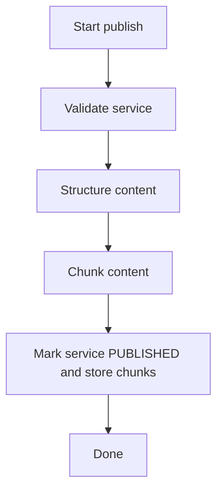
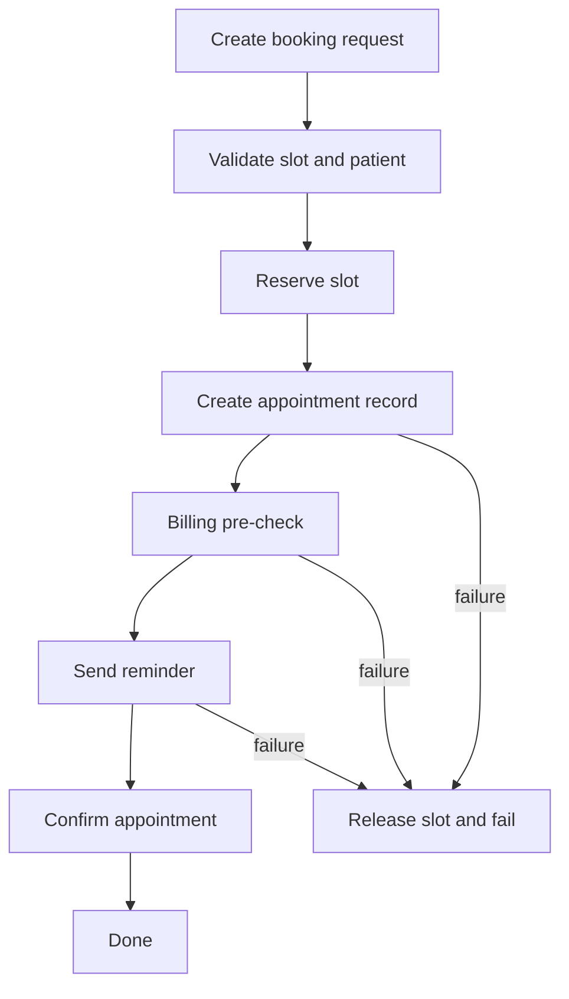

# SmartHealth Design

## Overview

SmartHealth is a healthcare scheduling API that supports:

- user registration and login
- role-based permissions
- department management
- provider profile creation
- service publishing
- slot scheduling and booking

The system is built with FastAPI, SQLAlchemy, and PostgreSQL.

## Architecture

- `app/api/`: FastAPI routers and endpoint definitions
- `app/core/`: application settings, authentication, dependency helpers, exception handling
- `app/models/`: SQLAlchemy ORM models and relationships
- `app/schemas/`: Pydantic request/response schemas
- `app/db/`: database engine and session management
- `app/seed.py`: development data seeding script

## Authentication and roles

Users can register with one of four roles:

- `patient`
- `provider`
- `front_desk`
- `admin`

Role rules:

- `patient` can only view available slots and their own patient profile
- `provider` can create their provider profile, create services, and manage slots
- `front_desk` can create departments, services, and slots
- `admin` can manage departments, providers, services, and slots

## Data model

### Entities

- `User`
  - email, hashed password, role
  - one-to-one with `Patient` or `Provider`

- `Patient`
  - belongs to a single `User`
  - stores patient profile fields and can book slots

- `Provider`
  - belongs to a single `User`
  - optionally belongs to a `Department`
  - offers services and has schedule slots

- `Department`
  - groups providers and services

- `Service`
  - belongs to a `Department`
  - can be published for public listing

- `Slot`
  - belongs to a `Provider` and a `Service`
  - optionally belongs to a `Patient` when booked
  - has `start_datetime`, `end_datetime`, and `status`

## ERD

```text
+------------+      +-------------+      +-------------+
|   users    |      | departments |      |   services  |
+------------+      +-------------+      +-------------+
| id         |<-----| id          |<-----| id          |
| email      |      | name        |      | name        |
| hashed_pwd |      | description |      | description |
| role       |      | created_at  |      | department_id|
| created_at |      | updated_at  |      | is_published|
+------------+      +-------------+      +-------------+
      ^                   ^                    |
      |                   |                    |
      |                   |                    v
      |                   |                +--------+
      |                   +--------------->|providers|
      |                                    +--------+
      |                                    | id     |
      |                                    | user_id|
      |                                    | dept_id|
      |                                    +--------+
      |                                        |
      |                                        v
+--------+                                 +-------+
|patient |                                 | slots |
+--------+                                 +-------+
| id     |                                 | id    |
| user_id|                                 | provider_id|
| first  |                                 | service_id |
| last   |                                 | patient_id |
+--------+                                 | status     |
                                            | start_datetime|
                                            | end_datetime  |
                                            +---------------+
```

## Major flows

### Register and login

1. `POST /auth/register`
2. `POST /auth/login`
3. use `Bearer <access_token>` for protected routes

### Provider onboarding

1. create authenticated user with role `provider`
2. call `POST /api/v1/providers` to create the provider profile
3. use provider token to create services and slots

### Slot creation

1. create a valid `Department`
2. create a `Provider` linked to that department
3. create a `Service` in that department
4. call `POST /api/v1/slots` with `provider_id` and `service_id`
5. call `POST /api/v1/slots/{slot_id}/reserve` to reserve an available slot

### Slot reservation

- Reservations use an atomic conditional update on `slots.status`.
- The reservation query only succeeds when the slot is still `AVAILABLE`.
- This prevents double-booking by ensuring the DB applies the update only once.
- The implementation uses a single `UPDATE ... WHERE id = ? AND status = 'AVAILABLE'` style operation so concurrent requests cannot both claim the same slot.

## Workflow and saga diagrams

### Service publish workflow



### Appointment booking saga



## Concurrency and consistency choices

- Slot reservation uses a conditional update so two concurrent requests cannot both claim the same slot.
- Booking idempotency is keyed by the authenticated user and the `Idempotency-Key` header, which allows safe retries without creating duplicate appointments.
- The appointment booking saga releases the reserved slot whenever a later step fails, preserving consistency between booking state and slot availability.

## Key implementation decisions

- The service publish flow is modeled as a workflow with distinct activities for validation, content structuring, chunking, and publication state changes.
- The appointment booking flow is implemented as a saga-style workflow that can compensate for later failures.
- The service and appointment state machines use explicit enums to restrict illegal transitions, and the API returns `409 Conflict` for invalid state moves.

## Notes

- Auth routes are mounted under `/auth`
- versioned business routes are under `/api/v1`
- services are only publicly listable when `is_published` is `true`
- `POST /api/v1/providers` always links the provider to the current authenticated user
